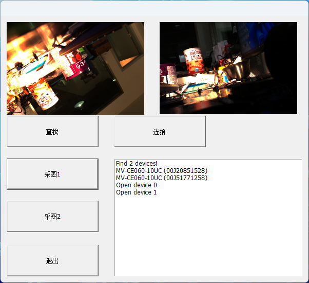

# hikvision usb camera demo with mfc

> wvv 20221223

### double camera demo

software trigger mode



### camera setting

```c++
for (unsigned int i = 0; i < m_stDevList.nDeviceNum; i++)
{
    if (NULL == m_pcMyCamera[i])
    {
        m_pcMyCamera[i] = new CMvCamera;
    }
    int nRet = m_pcMyCamera[i]->Open(m_stDevList.pDeviceInfo[i]);
    if (MV_OK != nRet)
    {
        delete(m_pcMyCamera[i]);
        m_pcMyCamera[i] = NULL;
        PrintMessage("Open device failed! DevIndex[%d], nRet[%#x]\r\n", i + 1, nRet);
        continue;
    }
    else
    {
        PrintMessage("Open device %d",i);
    }
    nRet = m_pcMyCamera[i]->SetEnumValue("TriggerMode", MV_TRIGGER_MODE_ON);
    if (MV_OK != nRet)
    {
        PrintMessage("Set Trigger source fail!");
    }
    nRet = m_pcMyCamera[i]->SetEnumValue("TriggerSource", MV_TRIGGER_SOURCE_SOFTWARE);
    if (MV_OK != nRet)
    {
        PrintMessage("Set Trigger source fail!");
    }
    nRet = m_pcMyCamera[i]->SetFloatValue("ExposureTime", 200000);
    if (MV_OK != nRet)
    {
        PrintMessage("Set exposure fail!");
    }
    nRet = m_pcMyCamera[i]->SetFloatValue("Gain", 0);
    if (MV_OK != nRet)
    {
        PrintMessage("Set gain fail!");
    }
    m_pcMyCamera[i]->RegisterImageCallBack(ImageCallBackEx, &para[i]);
    m_pcMyCamera[i]->StartGrabbing();
}
```

### trigger

```c++
void CHikCamDlg::OnBnClickedButton4()
{
	// TODO: 在此添加控件通知处理程序代码
	m_pcMyCamera[1]->CommandExecute("TriggerSoftware");
}


void CHikCamDlg::OnBnClickedButton5()
{
	// TODO: 在此添加控件通知处理程序代码
	m_pcMyCamera[0]->CommandExecute("TriggerSoftware");
}
```

### capture callback

```c++
void __stdcall ImageCallBackEx(unsigned char* pData, MV_FRAME_OUT_INFO_EX* pFrameInfo, void* pUser)
{
	Para* pa = (Para*)pUser;
	if (pFrameInfo)
	{
		//first set cam image to bgr8 format.
		Mat mat = cv::Mat(pFrameInfo->nHeight, pFrameInfo->nWidth, CV_8UC3, pData);
		Mat mp;
		resize(mat, mp, Size(400, 300));
		draw_mat(mp, pa->inst, pa->pic);
	}
}
```

